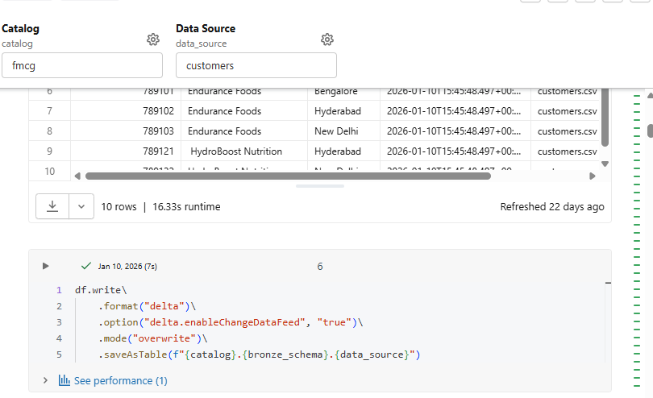
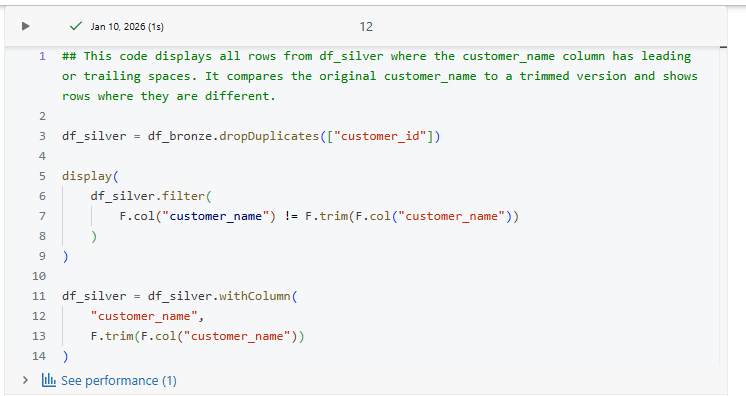

# Retail-Data-Consolidation-Pipeline
## End-to-End Data Engineering Project

### 🎯 Project Overview
This project demonstrates a real-world data engineering solution for consolidating data from two retail companies following an acquisition. Built using Databricks Lakehouse architecture, it showcases modern data engineering practices including the Medallion architecture pattern.

**Business Scenario:** A large FMCG retail company acquires a smaller competitor and needs to consolidate all sales, product, and customer data into a unified analytics platform.

### 🛠️ Tech Stack

- **Cloud Platform:** Databricks
- **Programming:** Python, SQL, PySpark
- **Data Ingestion:** Fivetran (Dropbox connector)
- **Architecture:** Medallion (Bronze-Silver-Gold)
- **Data Processing:** PySpark
- **Visualization:** Databricks BI Dashboards, Genie

### 📈 Pipeline Execution

1. **Bronze Layer:** The child company, **SportsBar**, stores its data in **Dropbox**, a cloud file storage service. A pipeline was created to ingest the data from Dropbox to bronze layer tables
   using **Fivetran** connection. I separated schema definitions into a utilities module for reusability and consistency, and I created Delta tables to store the data in its different layers
   transformation.

   
2. **Silver Layer:** In this layer, I cleaned, standardized and validated data against business requirements. These includes removing duplicates, removing trailing spaces from the data, correcting misspelled values, changing data types, etc

3. **Gold Layer:** After cleaning and transforming, I selected the required columns and wrote it to the Gold table.

The crux of this project is to merge the child company data with the parent company data, which already has its own data storage architecture in Databricks. The tables were merged on similar column values. 

### 🤝 Contributing

This is a learning project, but suggestions are welcome. Feel free to open an issue or submit a pull request.
